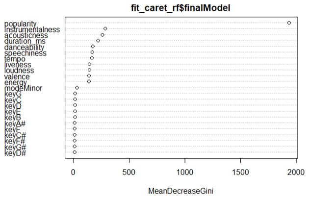
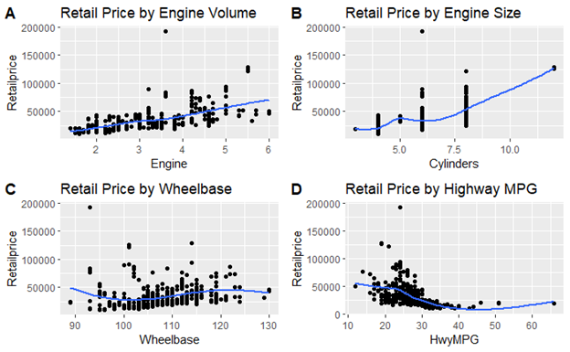

# Ryan Hass | Data Science Portfolio and Writing Samples

Hello and welcome!

Thank you for taking the time to review some of my work!

I've created this page to display some of the work I've completed in the fields of data analysis, data visualization, and data science. Additionally, I have samples of my writing that can be found towards the bottom of the page.

# About Me | Who is Ryan Hass?

Well, I'm glad you asked.

Professionally, I am a senior data analyst for Froedtert Health, a large hospital in Southern Wisconsin. I am a graduate of the [Data Science](https://datasciencedegree.wisconsin.edu/) Master's degree program from the University of Wisconsin-Green Bay. In my role, I focus on reporting (using SQL/Crystal), data visualization (using Qlik Sense/PowerBI), data analysis, and data science (using R/Python). Creating optimized solutions for data needs remains the main objective of the job. These efforts are focused on the Pharmacy within the hospital. Reporting and analysis on both specialty and non-specialty medications, employee workflows, business metrics, regulatory bodies, and adjudications exemplify the framework for daily challenges. 

I also have vast experience in the Pulp and Paper industry where I've worn multiple hats. I focused many years on developing a formalized problem-solving process to reduce costly failures and prevent reoccurrences. Methods included Cause Mapping, 6 Sigma methodologies, statistics/data analysis, and root cause analysis. I have many years of lab, quality, and continuous improvement experience. Lastly, I spent a considerable amount of time building a data repository for a major expansion project procuring, cleaning, and organizing equipment reliability data and storing it in the Computerized Maintenance Management Software. 

I have spent time working in academia both on research with the Unversity of Wisconsin-Madison, and on freelance data projects for The Citadel in South Carolina.

Outside of work, I participate in numerous hobbies including amateur astronomy, BBQ/Smoking, guitar playing, hunting/fishing, and cheering for the Minnesota Vikings. Skol Vikes! 

Below I have highlighted some relevant project work displaying some of my technical skills at a high level. Examples are from both academic and professional experiences.

If you have any questions or would like further explanation of any of these projects, feel free to contact me via email at hassrm08@gmail.com.

# [Project 1: Modeling Specialty Pharmacy Sales Volume](https://github.com/hassrm08/Capstone-Project)

The capstone project for M.S. Data Science program included an opportunity to work with a client to identify a use case for data science as well as apply the appropriate skills and methodologies to help solve the problem within the time constraints of a single semester.

Working with Pharmacy leaders, the need for a tool to help understand the demand fluctuations for the Specialty Pharmacy at Froedtert Health was determined. This was done through an evaluation of sales volume within the Specialty Pharmacy and used as an indicator for staffing levels.

(Proprietary) data was collected and heavy scrutiny was placed on variable selection and exploratory data analysis.

The data was reviewed and cleaned prior to being exported for analysis in R.

A series of regression models were applied to the data; Ridge, Lasso, and Elastic Net.

An optimal model was identified and many insights were derived to help the Pharmacy leaders understand their business in greater detail. Additionally, the results of the model were used in congruence with various other metrics to quantify the relationship between the variables and serve as a leading indicator of fluctuations in demand.

Much of the information is proprietary and confidential.

# [Project 2: Music Genre Prediction](https://github.com/hassrm08/Genre_Prediction)

The final project for DS740 - Data Mining & Machine Learning included the observation, cleaning, and analysis of real-life, publicly available data. I chose a dataset from [kaggle](https://www.kaggle.com/vicsuperman/prediction-of-music-genre?select=music_genre.csv), containing a large amount of characteristic data about a large variety of songs from Spotify.

This investigation is focused on the ability to predict a song’s genre based on a series of attributes that are thought to define a song. Country and Rock music share many attributes and being able to accurately identify one over the other is highly important when providing the listener with music that matches their preferences. Though my analysis focuses only on two of the available genres, it can be expanded to evaluate other genres. The data scientists at Spotify (in this case) who create music selection algorithms will be particularly interested in the answer to this question. Being able to tweak and improve their predictive methods to drive highly accurate, personalized recommendations is highly attractive for Spotify listeners. The differentiation of closely related genres can be particularly beneficial, which is the focus of this study.

Feature engineering was used to analyze, transform, and combine/remove some variables to aid in the accuracy of the analysis.

The final model performed with an accuracy of 82.19%. The model is sufficiently accurate to be used on new data, especially given the context of the problem.  

The figure above displays the importance of each variable compared to its ability to predict genre in my final model.

# [Project 3: Loan Default Prediction](https://github.com/hassrm08/Loan_Predict)

The final project for DS705 - Statistical Methods included the observation, cleaning, and analysis of loan data to predict the likelihood that a potential borrower would default on their loan.

Data was taken from 50,000 loans. The dataset included 30 potential predictor variables.

Feature engineering was used to analyze, transform, and combine/remove some variables to aid in the accuracy of the analysis.

The methods of analysis include a logistic regression model that was derived from the most relevant variables within the given data set including income, employment status, interest rate, salary, loan term, and overall applicant grade.

Overall, the logistic regression model created to predict if a loan applicant is likely to default on their loan is highly effective, accurately predicting loan status 57% of the time. The final classification threshold for loan status is equal to 0.82 for accuracy based on the maximized AUC and 0.80 for profit, which closely coincide with one another. The model optimized for accuracy correctly predicts loan status 57% of the time, while classifying good loans as good 51.0% of the time and bad loans as bad 79.8% of the time. The model optimized for profitability correctly predicts loan status with a percentage of 60%, while classifying good loans as good 56.3% of the time and bad loans as bad 73.4% of the time.

The figure above displays the graphical representation of the threshold selection process.

# [Project 4: Music Genre Popularity](https://github.com/hassrm08/Genre_Twitter_Analysis)

The final project for DS710 - Programming for Data Science included an open-ended analysis of Twitter data using the Twitter API.

I chose to evaluate the popularity of musical genres based on their perceived popularity on Twitter. Popularity, in this case, is determined by two measures. First, by overall tweet count within a predetermined amount of time and then by the number of exclamation marks used within a fixed number of tweets.

Tweets were collected using the REST API through Python. The program grabbed (up to 5000) tweets that were categorized into genres.

The Twitter data was reviewed and cleaned prior to being exported for analysis in R.

Two methods were used (in R Studio) in order to evaluate the relationship between tweet count and exclamation mark count by genre. First, I evaluated the potential for a linear relationship between both variables. The variables were plotted against one another in a scatterplot (Figure 3), and a summary of the linear model was created. Secondly, the variables (Tweet Count & Exclamation Count) were compared in a Chi-Squared Test of Independence.

Both analyses indicate that there is likely no relationship between the number of tweets mentioning a specific genre and the amount of exclamation marks within those tweets. It is important to mention that popularity is assumed by Tweet count, therefore; popularity cannot be determined by the number of exclamation marks within tweets mentioning specific musical genres.

The figure above displays the relationship between Exclamation count and Tweet count by Genre.

# [Project 5: Double Cross Validation](https://github.com/hassrm08/Double_CV)

Double Cross Validation is the Midterm project for DS740 - Data Mining and Machine Learning.

The goal of this project was to evaluate means of predicting the retail price of vehicles based on the predictors variables provided.

Additionally, model selection and assessment were done to determine the overall accuracy of the model as well as the model selection process using double cross-validation techniques.

The analysis was done using the 'caret' package in R.

Feature engineering was practiced to evaluate predictor variables.

Robust Regression and Elastic Net Regression methods were compared.

Model performance was tuned by the use of different model parameters.

Based on the information above, and the performance of my model selection process (70.5%), the aforementioned Elastic Net model is sufficiently accurate for making new predictions on individual data points, especially with lower-cost vehicles as displayed by the tightness of the data points on the lower end of the scale in Figure 2. The model is best at predicting price when the vehicle is worth ≈$50,000 or less.

The figure above represents the relationships between the response variable and certain predictor variables.

# [Project 6: Paper Quality Testing Gage Comparison](https://github.com/hassrm08/GBP_Data_Analysis)

The purpose of this project was to evaluate the correlation between different testing methods used to quantify paper strength.

Two main methods, S-test and Concora, were compared against one another to determine which method was more reliable.

Tests on various paper grades were compared to determine if there were any correlative effects between the testing methods.

Data was collected on various paper grades over a series of production runs. 

A full Gage R&R comparison was carried out with the Minitab statistical software. 

The results suggest that the S-test has a higher reliability based on the results of the Gage comparison.

In this case, it is recommended that Concora be phased out as the primary means of measuring machine direction paper strength and the S-test should take its place.

The visual above shows the relationship between various testers, and tests, and a summary of how reproducible and how repeatable the tests are compared with one another.

# Writing Samples

Writing samples will be added soon. 
